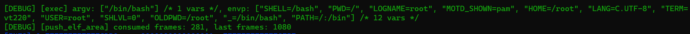

## NPUCore

### 简介

NPUCore是西北工业大学学生自研竞赛操作系统，该操作系统基于清华大学rCore框架，参考借鉴去年内核赛道哈尔滨工业大学（深圳）UltraOS队内核与linux内核的诸多优秀设计，并结合实际情况进行必要的优化和重构。

### 初赛完成情况

NPUCore已经完成了初赛所要求的30个系统调用的实现，并在评测平台上测试通过得到满分。
               

### NPUCore特色

+ ##### ELF_CACHE

我们在开发的过程中发现：文件系统只能做到基本的读写，且并没有实现缓存功能，这会导致同一个ELF文件在被多次加载时会产生大量的IO操作而使得操作系统非常慢。

我们在研究解决该问题时发现：到由于程序文件大小一般比较小，实际表现上还剩相当多内存。

上图是我们当时debug的情况，加载完第一个ELF文件shell后剩余的物理页上有一千多页，剩余的内存很多，于是我们考虑去尽可能利用这些充足的内存，设计了`ELF_CACHE`模块。该模块的实现思路比较简单，就是当ELF文件被加载进来的同时在内存中的某个地方先存起来，当物理页不足时将这些文件都从内存中释放。当同一个ELF文件被加载多次时就可以先尝试在内存中寻找是否有相应的缓存，如果有就直接从内存中复制减少IO开销。

`ELF_CACHE`是我们初期开发阶段的折中方案，该方案在没有着手研究文件系统时很有效。现阶段我们正努力开发文件系统，并为文件系统提供页缓存机制，在不久的将来`ELF_CACHE`可能就会成为历史。

+ ##### 信号系统

信号系统是linux进程间异步通信中的一个主要的方式，NPUCore也根据POSIX标准实现了一个简易的信号系统并编写相关系统调用，这套信号系统支持用户自定义信号处理函数。为了方便大家学习信号系统，我们写了一份`signal`文档（os文件夹下）教大家如何从零开始搭建一个信号系统。

+ ##### easy_fs

`easy_fs`是我们现在正在开发的一套针对比赛的文件系统，该文件系统在除了实现该模块采用前后端分离实现解耦，为将来的开发提供很大的空间。我们还在fs文件夹下写了几个文档介绍`easy_fs`以及我们开发的经过，可以用作教程供大家学习。