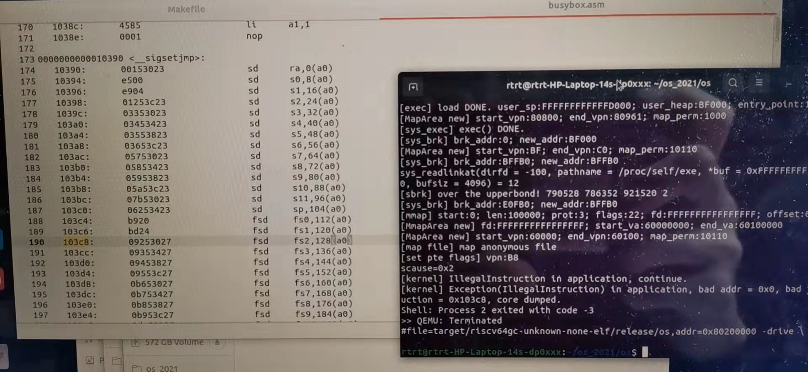
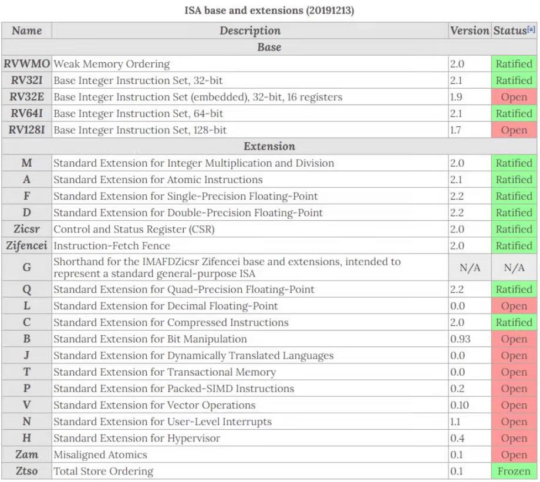
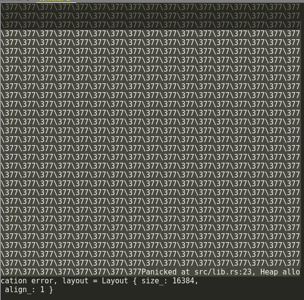

# 技术细节与错误文档

## OpenSBI兼容与跨平台

### 浮点数问题

运行lmbench和busybox的时候,我们发现程序会报错Illegal Instruction, 然后反汇编发现其报错的位置均为浮点数指令  

此外,我们尝试在k210上运行还发现,程序居然能正确运作,可见其只是在Qemu上有问题. 此外,参考部分其他队伍的代码我们发现,部分其他队伍使用的编译选项为imac  

如图,这张表显示的是不同后缀的处理器/编译器支持的指令范围,这说明imac后缀的编译器支持的范围不包括浮点数,而是采用int指令模拟.推断有可能是因为RustSBI在Qemu上不支持浮点数指令,所以需要改用OpenSBI进行引导,或者是使用imac进行编译.  
考虑到imac可能会有性能损失,且我们队伍在板子发下来之前只有一块板,但其他队员也需要开发,所以决定尝试支持OpenSBI

### OpenSBI的getchar()问题

由于这带来了将我们的系统支持OpenSBI的需求,我们不得不尝试将我们的系统移植到OpenSBI上.但一旦用OpenSBI启动,就会遇到这样的画面:, 那么,首先第一个问题: 377是什么? 不难看出,377 = 512 - 255, 而255显然是-1, 有可能是其返回了某个-1然后,也就是往往是某种失败. 同时,其屏幕记录上看似乎正常进入了进入了系统，说明说它进行了引导，通过这些综合信息，考虑到其是死循环在终端输入等待之前，回忆起之前实现ppoll的阻塞和非阻塞的关系没处理好的情况下，有时候屏幕上会连续出现大量同一字符，我们可以猜测OpenSBI本身已经被正确的引导，但是问题在于他很可能和RustSBI所使用的getchar()的方式分别是阻塞和非阻塞
首先我们查阅RISC-V文档可以发现其技术标准下应当是按照RustSBI的标准执行阻塞性的getchar，然后经过互联网上的搜索，我们同样可以找到特定的文献指出OpenSBI所使用的是非阻塞性的getchar()

顺便说一句，如果你使用的是最新版的rCore Tutorial那么你就会发现，其实当你转换到第9章的时候，这个问题已经被解决了。最新的版本本身就包含了对于缓冲区的支持。


## Qemu的多核启动问题

如果你的操作系统我们从Makefile
反之,如果你

## 内存问题

### rCore页表结构
首先要谈到rCore的页表结构.一个页表就是一个内存空间.每个程序有自己的用户页表,但内核的页表只有一个.此外,不论在内核空间还是用户空间,都有自己的栈和堆的概念,

### 跨页修改问题
基于之前的叙述,

## rCore非Linux标准接口和行为及其标准化

### sys_exec()

#### 用户程序参数加载方式问题

##### 问题历史

关注过去年比赛的人，一定会注意到去年的比赛之中，决赛所参考的两大用户程序，busybox和lmbench中许多队伍都卡在了后者的执行上面，而部分队伍注意到该用户程序的正确执行依赖于在sys_exec()的系统调用之中返回一个0
但是非常遗憾的事情是，如果你真的这么写了，你可能会正确的通过决赛的测试样例，但是当你尝试用同一个操作系统返回去测出赛的测试样例时，会发现所有跟参数数量相关的测试样例都会失败。例如， 使用Rust版的cat命令尝试读取文件系统之中的任何一个文本文件，你就会发现他毫不意外的失败了，提示是断言对应的参数数量不正确，用户程序提示说用户程序应当收到多于一个额外参数，但事实上却没有任何的额外参数，所以无法正确运行。

查阅不同的文献资料可以发现以下几个特性:首先, POSIX技术标准之中并没有所谓的sys_exec()的系统调用。它对应的实际上是一系列不同的其他系统调用家族，而这个rCore实现的系统调用只是其中的一个(execve)的弱化版本。手册之中还提到应当认为这个函数本身是永远不返回的，而当且仅当它的执行出现了错误的时候才会返回-1，作为函数的返回值。
另外通过阅读rCore的手册可以知道该函数实际返回的值是参数的数量。且返回值填入的寄存器是a0(10号寄存器)

##### 初步解决的过程

首先经过GDB的跟踪可以发现在代码之中，如果它的用户程序的额外参数数量是零个，那么本身main函数之中，是不会尝试复制任何的地址，也就是说强迫其对地址进行访问，仍然会导致内存越界访问而最终错误退出，那么也就是说这个问题可能并不只是单纯的用户程序参数的数量argc不对的问题。
另一方面也要考虑到在决赛之中，busybox的运行本身是依赖用户程序参数的，也就是说如果这个用户程序本身是完全失败的，那么他必然不可能完全能够运行这些东西。
另外这个问题本身还引申出了另一个疑问，就是对于参数来说，如果说它不应当被存到寄存器上，而应当在寄存器上返回0，那么它到底是如何正确得到用户程序本身的参数数量argc和参数地址argv的？
我们同时观察了rCore实现的exec()函数，似乎他将用户程序本身的参数准备分为两个部分，一个部分是将其正确的写入到所谓的寄存器之中，另一部分是将寄存器之中的用户程序参数数量和用户程序参数指针的数组都存到了内存的某个地址。这有可能说明确实存在两种不同的参数加载方式。

在测试的过程之中，我们偶然发现，其实比赛所提供的cat有两个不同的版本，一个是C语言的比赛官方版，另一个是Rust语言的rCore清华教程版。我们注意到其运行的一直都是Rust语言版本，那么这就存在另一种可能，有没有可能比赛官方的版本反而是能正常运作的。
因此我们尝试切换到比赛的版本，发现其比赛运作的版本是正常的，这说明说Rust语言的用户程序。和我们编译出的C语言的用户程序，在加载参数的过程之中，行为可能有很大的不同，现在的关键就是找到这个不同的部分，然后将其一移植Rust里。通过观察可以发现Rust用户程序的主函数参数形式和 C语言编写的所有的用户程序的主函数，参数形式不同，这说明说他们很有可能是通过了不同的方式导入了用户编写的主函数。
至少对C语言来说，通过文件夹结构来看，它很可能存在include之中的某个位置。翻找之后可以找到crt0这个东西。

用户程序中的main是如此处理其参数问题的:

``` c
#include <unistd.h>

extern int main();

int __start_main(long *p)
{
	int argc = p[0];
	char **argv = (void *)(p+1);

	exit(main(argc, argv));
	return 0;
}
```

而调用这个函数的crt.S的处理是这样的:

``` asm
.section .text.entry
.globl _start
_start:
    mv a0, sp
    tail __start_main
```

调用只有简单的一行,然后反汇编结果(brk测试程序,分号后为注释):

``` openqasm
_start:
    ;mv a0, sp
    1000:	850a                	mv	a0,sp
    ;tail __start_main
    1002:	a855                	j	10b6 <__start_main>

;int __start_main(long *p)
00000000000010b6 <__start_main>:
;{
    10b6:	85aa                	mv	a1,a0
	int argc = p[0];
	char **argv = (void *)(p+1);

	exit(main(argc, argv));
    10b8:	4108                	lw	a0,0(a0) ;获取argc
;{
    10ba:	1141                	addi	sp,sp,-16
	exit(main(argc, argv));
    10bc:	05a1                	addi	a1,a1,8 ;获取argv
;{
    10be:	e406                	sd	ra,8(sp)
;	exit(main(argc, argv));
    10c0:	fe7ff0ef          	jal	ra,10a6 <main>
    10c4:	39b000ef          	jal	ra,1c5e <exit>
;	return 0;
;}
    10c8:	60a2                	ld	ra,8(sp)
    10ca:	4501                	li	a0,0
    10cc:	0141                	addi	sp,sp,16
    10ce:	8082                	ret
```

可以注意到这是一段汇编代码,其从 **内存** 中加载argc和argv现在的关键就是去Rust之中找到它的对应代码，然后将其写入同样是在其对应的文件夹之中，能找到连接的用户库。考虑到我们对原理并不完全熟悉,最早一版的代码实现方式实际上是objdump出汇编代码然后写入到Rust代码的.但最后完成.

另外很奇怪的是这段代码刚刚上的时候，如果对于其他的用户程序使用这样的加载过程是正确的，但是对初始进程initproc，这个加载过程会最终导致崩溃(其没有使用参数且加载使用的是new()函数不是正常的加载过程)。所以需要使用弱链接的方式将这段代码作为默认代码.

借用这样的原理,我们可以编写出下列代码(常规程序带参数加载):

其中, `#[linkage = "weak"]` 的意义为,让其在没有找到自行实现的该函数的时候加载该实现,相当于是函数实现的"默认值"

``` rust
#[linkage = "weak"]
#[no_mangle]
#[link_section = ".text.entry"]
pub extern "C" fn _start() -> ! {
    let argc: usize;
    let argv: usize;
    unsafe {
        asm!(
            "ld a0, 0(sp)",
            "add a1, sp, 8",
            out("a0") argc,
            out("a1") argv
        );
    }
    _parameter(argc, argv);
}

#[linkage = "weak"]
#[no_mangle]
pub extern "C" fn _parameter(argc: usize, argv: usize) -> ! {
    unsafe {
        HEAP.lock()
            .init(HEAP_SPACE.as_ptr() as usize, USER_HEAP_SIZE);
    }
    let mut v: Vec<&'static str> = Vec::new();
    for i in 0..argc {
        let str_start =
            unsafe { ((argv + i * core::mem::size_of::<usize>()) as *const usize).read_volatile() };
        let len = (0usize..)
            .find(|i| unsafe { ((str_start + *i) as *const u8).read_volatile() == 0 })
            .unwrap();
        v.push(
            core::str::from_utf8(unsafe {
                core::slice::from_raw_parts(str_start as *const u8, len)
            })
            .unwrap(),
        );
    }
    exit(main(argc, v.as_slice()));
}
```

首先是start入口,我们汇编加载两个变量并输出为argc和argv, 然后调用参数准备  
之后, 参数准备函数将各个参数推入参数数组并加载主函数__
而对于不加载任何参数的initproc来说,我们则采用手动实现的方式实现其入口  
可以看到这里没有"weak"的连接,他代替了弱连接,是这个程序使用的实现.

``` rust
#[no_mangle]
#[link_section = ".text.entry"]
pub extern "C" fn _start() -> ! {
    exit(main());
}
```

##### 关于问题溯源

首先早期的操作系统和架构，它用户程序传入参数的方式确实是把参数压进栈里头，而我们编译出的用户程序继承了这一遗留的特性，也同样尝试从内存之中读出它对应的参数，也就是用户程序的参数数量和用户程序的参数地址。
至于说技术规格谈到的exec()系列函数，永远不应当返回，是相对于原来的控制流而言，因为这个函数本身会照着控制流继续往下执行，但是在执行了这个函数之后，用户程序本身的镜像会完全被替换为新的即将执行的用户程序的映像。但是分析Linux代码之后可以注意到，对于这个函数的行为（以Linux为参照）本身它相当于是返回了0，因为他的行为实际上是将其中的多数通用寄存器都清零了。
清华的做法本身也不能说是完全错误，因为按照RISC-V的技术规格的规定，一个函数它本身的参数就应当是被储存在存器当中。既然main函数本身也是一个普通的函数，那么这个函数就也可以将它的所有参数包括argc和argv都储存在寄存器中.只不过,这并不符合Linux的遗留行为,也就没有被用作对main的处理了


### wait()系列函数的不一致

#### 未检查空指针问题
如果你将文件系统修改为fat32的rCore-Tutorial-3.5用于测试比赛官方去年放出的fork的测试程序,会发现其最后会失败panic, 这是因为rCore的调用中没有检测空指针,默认直接访问,这会导致执行上的问题. 

``` rust
    *translated_refmut(inner.memory_set.token(), exit_code_ptr) = exit_code;
```

在写入之前应该先判断.

#### wait, waitpid, wait4问题

首先,rCore的原版实现是不完整的,不但wait使用的是异步的方式(其阻塞的同步函数是在用户库中使用手动loop循环模拟的),而且会有未退出时返回-2的奇怪操作. 这导致如果按照标准调用规则执行的程序被放到自制系统下直接允许,会出现未定义行为.Linux下的wait系列函数的完整实现很复杂,建议参考manpage中wait4的相关章节

除此之外,rCore的调用号也不匹配: 其waitpid使用的是wait4的调用号,但其实现的功能是不完整的,如果直接接入Linux的程序,很可能会出现问题.

### tp寄存器及其保存

如果你使用过早期版本的rCore进行迭代开发的话，那么你可能会发现下列奇怪的现象:
例如,当你尝试支持busybox的ash的时候,以及你尝试对某些进行多线程的程序进行支持的时候，可能会出现一些莫名其妙的store page fault, 并且当你尝试使用汇编代码对这些错误进行分析或者追踪的时候，你可能会毫无意外的看到这些代码附近有一条tp寄存器赋值给目前作为原地址的寄存器的行为.
这是因为我们参考的rCore-Tutorial中由于用不到,没有记得保存tp(thread pointer)寄存器, 也就让大量使用该寄存器的程序出现问题. 记得在trap.S和switch.S中保存即可
